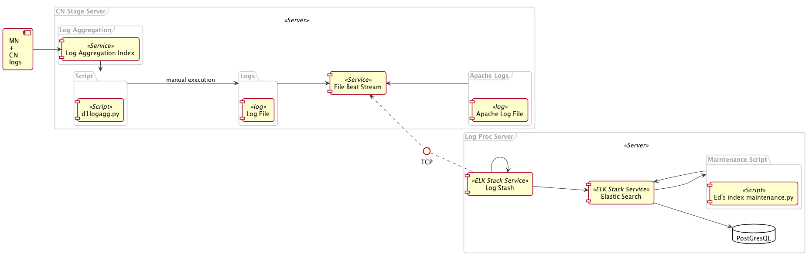

MDC Log Processing Architecture
===============================

.. TODO: Describe the architecture of how the components interact

Component Diagram
-----------------
..
  @startuml mdc-log-processing-architecture.png

    !include plantuml-styles.txt
    
    top to bottom direction
    
    ' For component diagram help see http://plantuml.com/component-diagram
    ' Define the components
    
    component comp1 [
    MN
    +
    CN
    events
    ]

    frame "CN Stage Server" as "cnserv" <<Server>> {
        frame "Log Aggregation" as "logagg" {
            [Log Aggregation] <<Service>>
        }
        
        database "logsolr" {

        }
        
        folder "Logs" as logs{
            component [Log File] <<log>>
        }
        
        frame "Apache Logs" as "apache" {
            component [Apache Log File] <<log>>
        }

        
        [File Beat Stream] <<Service>>

    }
    
    frame "Log Proc Server" as "logproc" <<Server>> {
        component [Log Stash] <<ELK Stack Service>>
        
        component [Elastic Search] <<ELK Stack Service>>
    }

    component comp2 [
    Metrics Service
    ]
    
    
    ' Define the interactions
    comp1 --> [Log Aggregation]: ""
    [Log Aggregation] -down-> logs: "Writing to disk in JSON format"
    [Log Aggregation] --> logsolr: "Saving logs to logsolr index"
    logs -down-> [File Beat Stream]:  ""
    apache -up->  [File Beat Stream] : ""
    [Log Stash] .up. TCP : ""
    TCP .up.> [File Beat Stream] : ""
    [Log Stash] --> [Log Stash] : "Filtering and Session Calculation"
    [Log Stash] --> [Elastic Search] : ""
    comp2 -right-> [Elastic Search] : "Query for the log records"

    
  @enduml

