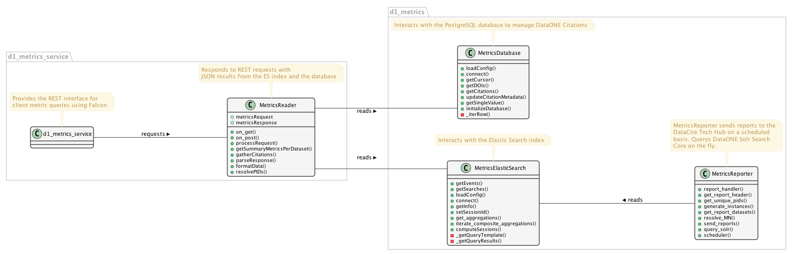

Metrics Service Class Diagram
==============================

- The Falcon `d1_metrics_service.py` is where the Falcon API creates a WSGI application and the Gunicorn server runs this application.

- Resource object is created from the class `MetricsReader` which is eventually mapped to the end-points into the `d1_metrics_service.py`.

- The JSON `MetricsRequest` object from the HTTP requests is passed on to the `MetricsReader` class for further processing.

- The `MetricsReader` class parses the `MetricsRequest` object and based on the filtering properties calls the appropriate method of the `MetricsDatabase` class from the `d1_metrics` package.

- The `MetricsDatabase` class has methods that establishes a connection pool and returns a cursor object that can perform the `DBMS CRUD` operations. This class has methods that would query the Database tables and/or Materialized views.

- The `MetricsDatabase` class retrieves the queries results from the Database and returns the results to the `MetricsReader` class. The `MetricsReader` class forms a `MetricsResponse` object which is sent back to the client as HTTP Response.

Class Diagram
-----------------
..
  @startuml ./images/metrics-service-class-diagram.png

    !include ./plantuml-styles.txt

    left to right direction

    ' For class diagram help see http://plantuml.com/class-diagram
    ' Define the classes

package d1_metrics {
    class MetricsDatabase {
        + loadConfig()
        + connect()
        + getCursor()
        - _iterRow()
        + getSingleValue()
        + initializeDatabase()
        + summaryReport()
        + setMetadataValue()
        + getMetadataValue()
        + deleteMetadataValue()
        + getMetadata()
        + get_landing_page_metrics()
        + get_user_profile_metrics()
        + get_user_profile_charts()
        + get_search_metrics()
        + get_metrics()
        + upsert_metrics()
    }
    
    class MetricsReporter {
        + query_SOLR()
        + generate_reports()
        + send_reports()
    }
    
    class MetricsElasticSearch {
        + getEvents()
        + getSearches()
        + loadConfig()
        + connect()
        + getInfo()
        + setSessionId()
        - _getQueryTemplate()
        - _getQueryResults()
    }
}

package d1_metrics_service {
    class MetricsReader {
        + metricsRequest
        + metricsResponse
        + processRequest()
        + on_get()
        + on_post()
    }

    class d1_metrics_service {

    }
}

interface Client {

}

interface Hub {

}

interface ElasticSearch {

}

    ' Define the interactions
    Client -down- d1_metrics_service : sendsHTTPRequest >
    d1_metrics_service -up- Client: returnsHTTPResponse >
    d1_metrics_service -down- MetricsReader: sendsRequest > 
    MetricsReader -up- d1_metrics_service: generatesResponse >
    MetricsReader -down- MetricsDatabase: queryTo >
    MetricsDatabase -up- MetricsReader: sendsResults >
    MetricsElasticSearch -down- MetricsDatabase: performs{Create/Read/Update} >
    MetricsDatabase -up- MetricsReporter: sendsResults >
    MetricsReporter -up- Hub :  reportsTo >
    MetricsElasticSearch -up- ElasticSearch : < writesTo 
    ElasticSearch -up- MetricsElasticSearch : < readsFrom

  @enduml

