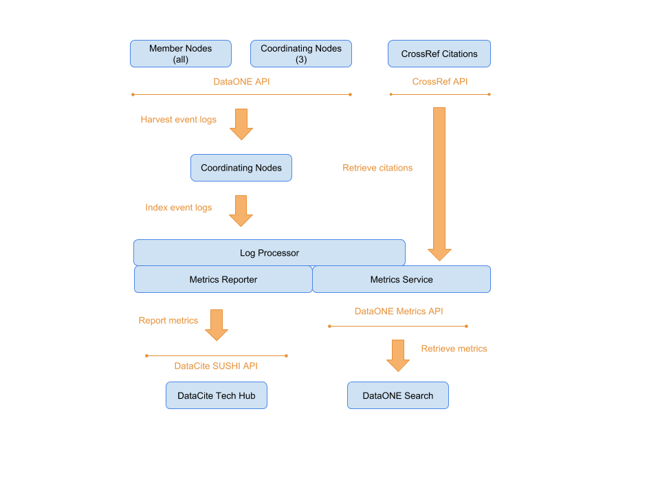

.. DataONE Metrics Service documentation master file, created by
   sphinx-quickstart on Thu Oct  4 09:42:09 2018.
   You can adapt this file completely to your liking, but it should at least
   contain the root `toctree` directive.

DataONE Metrics Service
=======================

The DataONE metrics service provides information about the use of content across the entire
DataONE federation and makes those metrics available at various levels of detail. A high level
overview of the infrastructure is provided in Figure 1.

**Figure 1.** High level implementation of the DataONE Metrics Service.

Events such as READ activity are logged by Member (MN) and Coordinating (CN) Nodes
and aggregated by the log aggregation service on the CNs. Further processing is performed
done based on the `COUNTER Code of Practice <https://peerj.com/preprints/26505>`_
at the Log Processor. The Metrics Reporting service generates reports for the
`DataCite SUSHI API <https://www.niso.org/schemas/sushi>`_
and sends them to the DataCite HUB. The DataONE Metrics API uses these processed logs
to drive metrics display on the DataONE search interface.

.. toctree::
   :maxdepth: 2
   :caption: Contents:

   architecture
   metrics_service
   elastic_queries
   event_examples
   apache_log
   implementation

Indices and tables
==================

* :ref:`genindex`
* :ref:`modindex`
* :ref:`search`
