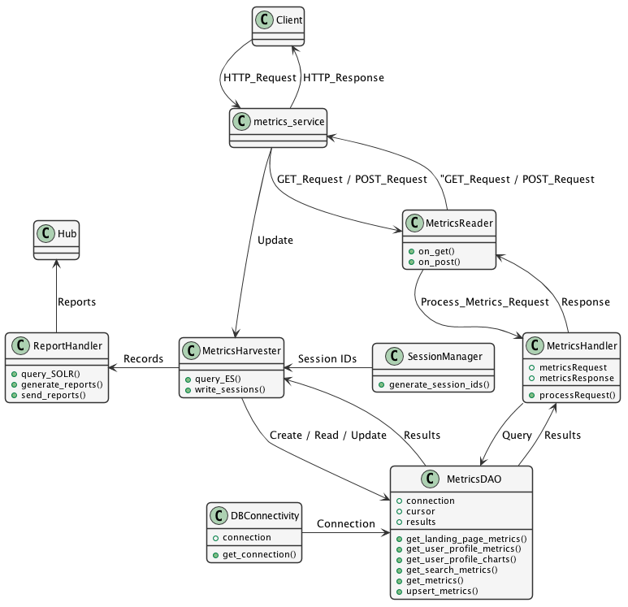

Metrics Service Class Diagram
==============================

\- The Falcon `app.py` is where the Falcon API creates a WSGI application and the Gunicorn server runs this application.

- Separate resources are created from the classes `GetMetrics` and `PostMetricsFilters` which are eventually mapped to
the end-points into this `app.py`.

- The HTTP requests then are redirected to the corresponding classes based on the mappings available on the `app.py`.

- Both these classes load the JSON `MetricsRequest` object from the HTTP requests and pass it on to the MetricsHandler
class for further processing.

- The `MetricsHandler` class parses the `MetricsRequest` object and based on the filtering properties calls the
appropriate method of the `ApplicationDAO` class.

- The `ApplciationDAO` class takes the connection object from the `DBConnectivity` class and creates a cursor that can
perform the `DBMS CRUD` operations. This class has methods that would query the Database tables / Materialized views.

- The ApplicationDAO class retrieves the queries results from the Database and returns the results to the `MetricsHandler`
class. The `MetricsHandler` class forms a `MetricsResponse` object which is sent back to the client as HTTP Response.

Class Diagram
-----------------
..
  @startuml ./metrics-service-class-diagram.png

    !include ./plantuml-styles.txt

    top to bottom direction

    ' For class diagram help see http://plantuml.com/class-diagram
    ' Define the classes

    class DBConnectivity {
        + connection
        + get_connection()
    }

    class ApplicationDAO {
        + connection
        + cursor
        + results
        + get_landing_page_metrics()
        + get_user_profile_metrics()
        + get_user_profile_charts()
        + get_search_metrics()
        + get_metrics()
    }

    class MetricsHandler {
        + metricsRequest
        + metricsResponse
        + processRequest()
    }

    class GetMetrics {
        + on_get()
    }

    class PostMetricsFilters {
        + on_post()
    }

    ' Define the interactions
    Client -down-> Falcon_app :"HTTP_Request"
    Falcon_app -up-> Client: "HTTP_Response"
    Falcon_app -down-> GetMetrics: "GET_Request"
    GetMetrics -up-> Falcon_app: "GET_Response"
    Falcon_app -down-> PostMetricsFilters: "POST_Request"
    PostMetricsFilters -up-> Falcon_app : "POST_Response"
    GetMetrics -down-> MetricsHandler: "Process_Metrics_Request"
    PostMetricsFilters -down-> MetricsHandler: "Process_Metrics_Request"
    MetricsHandler -up-> GetMetrics: "Reponse"
    MetricsHandler -up-> PostMetricsFilters: "Response"
    MetricsHandler -left-> ApplicationDAO: "Query"
    ApplicationDAO -right-> MetricsHandler: "Results"
    DBConnectivity -right-> ApplicationDAO: "Connection"

  @enduml

